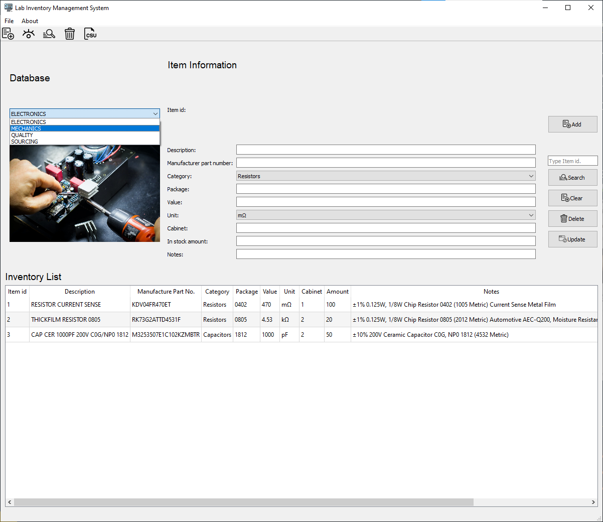
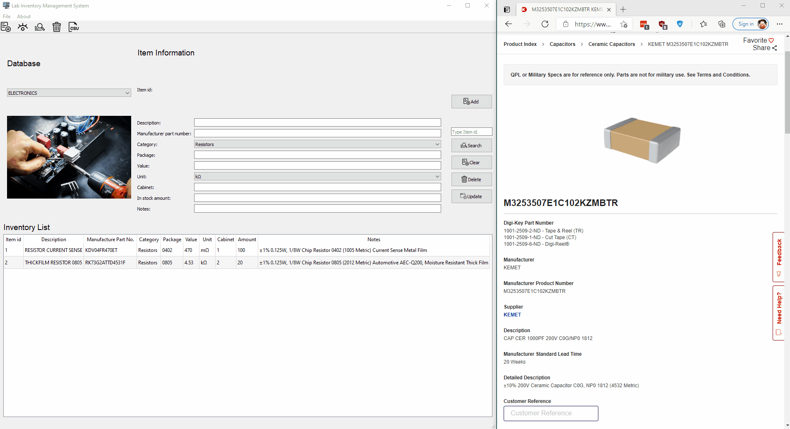

# Laboratory Inventory Management System

A GUI application which manages the inventory of a workshop by different departments, the items are stored in a database in different tables.

## Dependencies and packages:

- Python 3.7.4
- PyQt5
- sqlite3
- pandas

## Screenshot





## Convert to .exe file

To convert the .py extension file to an .exe file in Windows, install the package `pyinstaller` via 
```
pip install pyinstaller
```
Then open the terminal in the repository folder, and run the command below
```
pyinstaller --onefile -w .\application.py
```
The application.exe can be found in the subfolder *dest*.